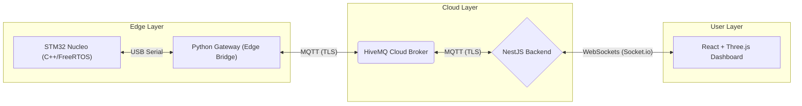

# Industrial IoT Digital Twin

**A bi-directional industrial monitoring system featuring a 3D Digital Twin visualization.**

This project demonstrates a complete **End-to-End IoT Pipeline**: from **Bare-Metal Firmware** running on real STM32 hardware to a **Cloud-Native Backend**, ending in a high-performance **Interactive 3D Dashboard**. It simulates high-speed industrial motor monitoring (temperature/vibration) and allows remote operator control (e.g., Emergency Reboot) from the cloud back to the physical chip.

## System Architecture

The system follows a **Bi-Directional Event-Driven Architecture**. It bridges the "Edge" (Physical Hardware) to the "Cloud" (NestJS/React) using secure MQTT and WebSockets.



### Key Data Flows

* **Upstream (Telemetry):** Sensors → FreeRTOS Tasks → Serial → Python Gateway → HiveMQ → NestJS → React 3D Model.
* **Downstream (Control):** User clicks "Reboot" → NestJS API → HiveMQ → Python Gateway → Serial → STM32 Hardware Reset.

## Technology Stack

This project bridges Embedded Systems with modern Cloud-Native Web Development.

### 1. Firmware & Edge (The "Hard" Engineering)

* **Hardware:** STM32G431KB Nucleo-32
* **OS:** FreeRTOS (Real-Time Operating System)
* **Language:** C++ (Firmware), Python (Edge Gateway)
* **Libraries:** STM32Duino, ArduinoJson, PySerial

### 2. Infrastructure & Backend (The "Systems" Layer)

* **Cloud Broker:** HiveMQ Cloud (MQTT over TLS)
* **Backend:** Node.js (NestJS Framework)
* **Architecture:** Microservices (MQTT Transport)
* **Communication:** WebSockets (Socket.io), REST API

### 3. Frontend (The "Product" Layer)

* **Framework:** Next.js (React 18)
* **3D Engine:** Three.js (via React-Three-Fiber)
* **Styling:** Tailwind CSS
* **State:** React Context / Hooks

## Project Structure

A Monorepo structure maintaining the full stack in one place.

```bash
├── backend/          # NestJS API (MQTT Consumer & WebSocket Gateway)
├── firmware-stm32/   # PlatformIO Project (C++ & FreeRTOS code for STM32)
├── firmware-sim/     # Python Edge Gateway (Bridges USB Serial to Cloud)
├── frontend/         # Next.js + Three.js Dashboard (3D Visualization)
└── infrastructure/   # Docker configurations (Legacy/Local Dev)
```

## Getting Started

### Prerequisites

* **Hardware:** STM32 Nucleo Board (Optional - Simulator available)
* **Software:** VS Code, PlatformIO Extension, Node.js v18+, Python 3.9+

### 1. Flash the Firmware (STM32)

1. Open `firmware-stm32` in VS Code (PlatformIO).
2. Connect your Nucleo board via USB.
3. Build & Upload:

   ```bash
   pio run --target upload
   ```

   *Result: Green LED blinks (Heartbeat) indicating FreeRTOS is running.*

### 2. Start the Backend

Initialize the Cloud Gateway.

```bash
cd backend/api
npm install
npm run start:dev
```

*The API listens on Port 3001 and connects to HiveMQ Cloud.*

### 3. Start the Edge Gateway

Bridge your physical device to the Cloud.

```bash
cd firmware-sim
# Update gateway.py with your COM Port (e.g., COM5)
python gateway.py
```

*Terminal should say: "Connected to HiveMQ Cloud" and "Forwarded: { temp: ... }"*

### 4. Launch the Frontend

Start the 3D Dashboard.

```bash
cd frontend
npm install
npm run dev
```

Open `http://localhost:3000` to see the Digital Twin live.

## Roadmap

- [x] Phase 1: Infrastructure Setup (HiveMQ Cloud)
- [x] Phase 2: Backend Gateway (NestJS MQTT-to-WebSocket)
- [x] Phase 3: Hardware Implementation (STM32 + FreeRTOS + JSON)
- [x] Phase 4: Edge Bridge (Python Serial-to-MQTT)
- [x] Phase 5: 3D Visualization (Real-time Sync)
- [x] Phase 6: Bi-Directional Control (Remote Reboot)
- [ ] Phase 7: Anomaly Detection (TinyML on Edge)

## Author

**Ayyan Ahmed**
*M.Sc. Information & Communication Engineering | TU Darmstadt*

* **GitHub:** [github.com/AyyanYe](https://github.com/AyyanYe)
* **Focus:** Full-Stack Engineering & Embedded Systems

## License

This project is licensed under the MIT License - see the LICENSE file for details.
