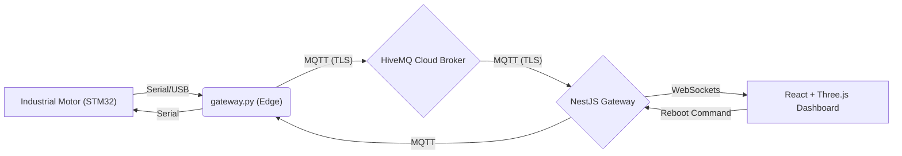

# Industrial IoT Digital Twin

[](https://opensource.org/licenses/MIT)
[](https://github.com/AyyanYe)
[]()

**A real-time industrial monitoring system featuring a 3D Digital Twin visualization.**

This project demonstrates an end-to-end IoT pipeline: from **bare-metal firmware** running FreeRTOS, up through a **Python Edge Bridge** to **cloud infrastructure**, ending in a high-performance **interactive frontend**. It simulates the monitoring of high-speed industrial motors, detecting anomalies in vibration and temperature via statistical edge-inference.

---

## System Architecture

The system follows a **Bi-Directional Event-Driven Architecture**. It bridges the "Edge" (Physical Hardware) to the "Cloud" (NestJS/React) using secure MQTT and WebSockets.


```mermaid
graph LR
    A["Industrial Motor (STM32)"] -- "Serial/USB" --> B("gateway.py (Edge)")
    B -- "MQTT (TLS)" --> C{"HiveMQ Cloud Broker"}
    C -- "MQTT (TLS)" --> D{"NestJS Gateway"}
    D -- "WebSockets" --> E["React + Three.js Dashboard"]
    E -- "Reboot Command" --> D
    D -- "MQTT" --> B
    B -- "Serial" --> A
```

**Key Data Flow:**
1.  **Edge:** Sensor data is acquired (C++ STM32/FreeRTOS), processed for anomalies (Z-Score), and packed into JSON.
2.  **Bridge:** `gateway.py` maps the physical USB Serial to Cloud MQTT.
3.  **Transport:** Data is transmitted via **HiveMQ Cloud TLS**.
4.  **Ingestion:** **NestJS** microservice consumes MQTT messages.
5.  **Visualization:** Data is broadcast via **WebSockets** to a **Next.js** frontend, driving a 3D model in real-time.
6.  **Control:** The frontend can send a "REBOOT" signal all the way back down to the STM32 board.

---

## Technology Stack

### **1. Firmware & Edge**
  * **Language:** C++ (STM32 Target) / Python (Bridge & Sim)
  * **RTOS:** FreeRTOS (Task generation, heartbeat)
  * **Edge ML:** Statistical Anomaly Detection (Z-Score)

### **2. Backend & Infrastructure**
  * **Runtime:** Node.js (NestJS Framework)
  * **Broker:** HiveMQ Cloud (TLS)
  * **API:** REST & WebSockets (Socket.io)

### **3. Frontend**
  * **Framework:** Next.js (React)
  * **3D Engine:** Three.js (via React-Three-Fiber)
  * **Styling:** Tailwind CSS

---

## Project Structure

This repository uses a **Monorepo** structure.

```bash
├── backend/          # NestJS API, MQTT Consumer & WebSocket Broadcaster
├── frontend/         # Next.js + Three.js 3D Digital Twin Dashboard
├── firmware-stm32/   # STM32 C++ FreeRTOS Firmware with Anomaly Detection
├── firmware-sim/     # Python-based Hardware Simulator 
└── gateway.py        # Edge Bridge mapping USB Serial to HiveMQ Cloud
```

---

## Getting Started

### Prerequisites

  * **Node.js v18+** (For Backend/Frontend)
  * **Python 3.9+** (For Simulator & Edge Gateway)
  * **PlatformIO** (For compiling STM32 Firmware)

### 1\. Start the Backend Gateway

The NestJS API bridges HiveMQ Cloud to WebSockets.

```bash
cd backend/api
npm install
npm run start:dev
```

*The API listens on Port 3001 and connects to HiveMQ Cloud.*

### 2\. Start the Frontend Dashboard

```bash
cd frontend
npm install
npm run dev
```
Navigate to `http://localhost:3000` to see the dashboard.

### 3\. Flash the Hardware (Optional)

If you have a Nucleo-G431KB, flash `firmware-stm32` using PlatformIO:
```bash
cd firmware-stm32
pio run -t upload
```

### 4\. Run the Edge Bridge

To connect the actual STM32 hardware to the Cloud over USB Serial:

```bash
pip install pyserial paho-mqtt
python gateway.py
```

*(Alternatively, you can simulate a motor by running `python firmware-sim/motor_sim.py` if no physical board is present).*

---

## Roadmap / Completed Phases

  - [x] **Phase 1:** Infrastructure Setup (HiveMQ Cloud Integration)
  - [x] **Phase 2:** Backend Gateway (NestJS MQTT-to-WebSocket)
  - [x] **Phase 3:** Hardware Implementation (STM32 + FreeRTOS + JSON)
  - [x] **Phase 4:** Edge Bridge (Python Serial-to-MQTT `gateway.py`)
  - [x] **Phase 5:** 3D Visualization (Real-time Sync via Next.js/Three.js)
  - [x] **Phase 6:** Bi-Directional Control (Remote Reboot from UI down to STM32)
  - [x] **Phase 7:** Statistical Anomaly Detection (Z-Score inference on Edge)

---

## Author

**Ayyan Ahmed**
*M.Sc. Information & Communication Engineering | TU Darmstadt*

  * **GitHub:** [github.com/AyyanYe](https://github.com/AyyanYe)
  * **Focus:** Full-Stack Engineering & Embedded Systems

---

## License

This project is licensed under the **MIT License**.
